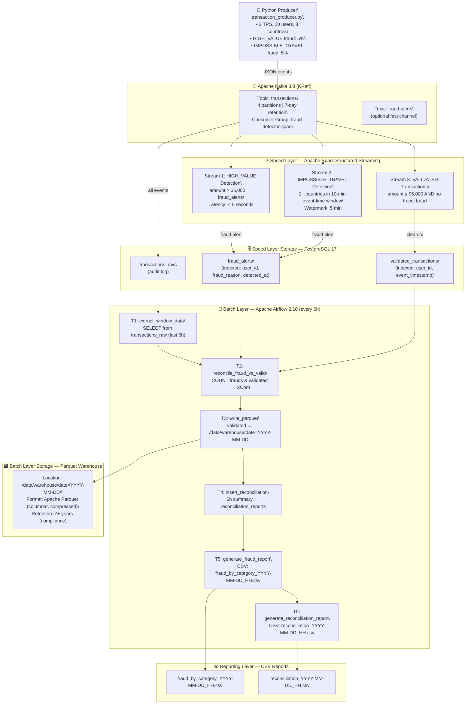
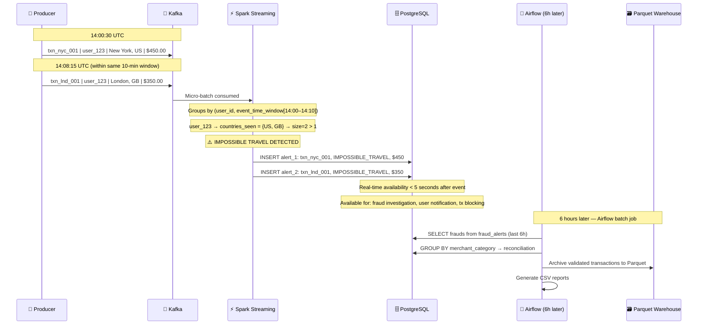
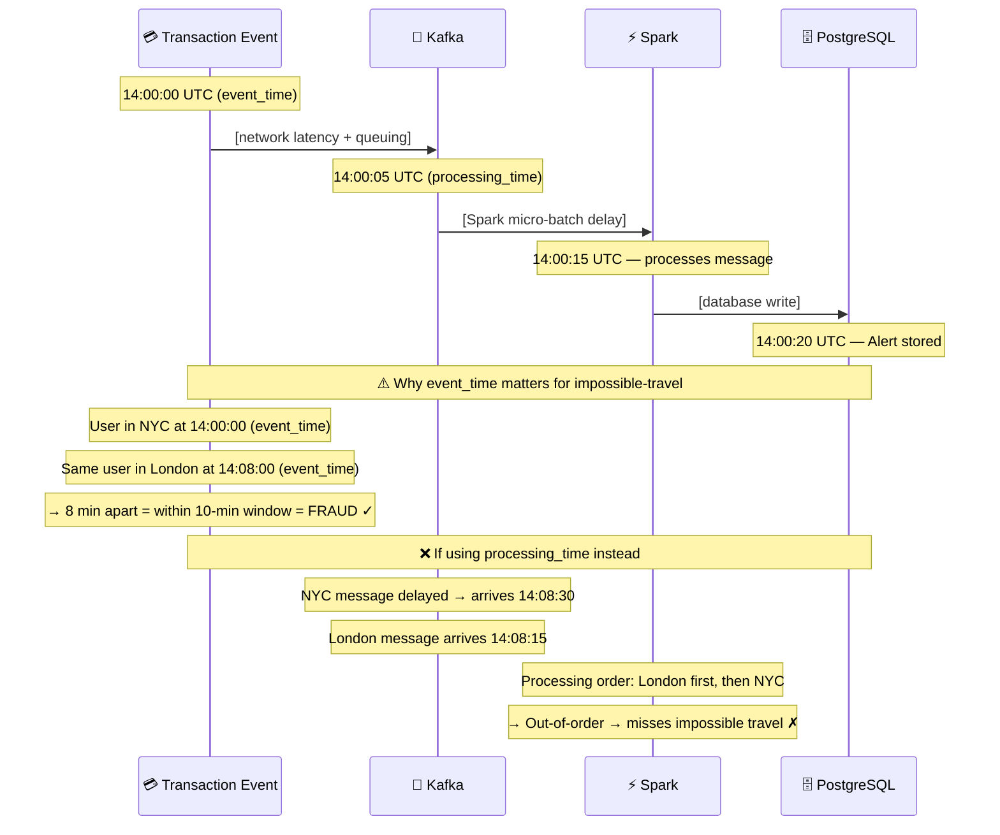

# FinTech Fraud Detection Pipeline — Lambda Architecture

**Applied Big Data Engineering (EC8207) — Mini Project**
**Scenario 2: FinTech Fraud Detection Pipeline**

A production-grade Lambda Architecture implementation for real-time fraud detection using Apache Kafka, Spark Structured Streaming, Airflow, and PostgreSQL.

---

## 📑 Table of Contents

1. [Executive Summary](#executive-summary)
2. [Technology Stack Justification](#technology-stack-justification)
3. [Architecture Overview](#architecture-overview)
4. [System Requirements](#system-requirements)
5. [Quick Start Guide](#quick-start-guide)
6. [Detailed Setup Instructions](#detailed-setup-instructions)
7. [Running the Pipeline](#running-the-pipeline)
8. [Monitoring &amp; Testing](#monitoring--testing)
9. [Output Reports](#output-reports)
10. [Event Time vs. Processing Time](#event-time-vs-processing-time)
11. [Ethics &amp; Data Governance](#ethics--data-governance)
12. [Database Schema](#database-schema)
13. [Troubleshooting](#troubleshooting)
14. [Performance Tuning](#performance-tuning)

---

## Executive Summary

This project implements a **production-grade fraud detection system** for a digital wallet provider using a Lambda Architecture. The system detects fraudulent transactions in **real-time** (< 5 seconds) while maintaining historical data for **batch analysis** every 6 hours.

### Key Features

✅ **Real-time Fraud Detection**: HIGH_VALUE and IMPOSSIBLE_TRAVEL patterns detected within seconds
✅ **Controlled Fraud Injection**: 5% synthetic fraud rate for realistic testing
✅ **Event-time Windowing**: 10-minute tumbling windows with 5-minute watermarks
✅ **Hourly ETL Pipeline**: 6-hour batch reconciliation jobs
✅ **Multi-stage Storage**: Speed layer (PostgreSQL) + Batch layer (Parquet warehouse)
✅ **Production-ready**: Docker containerization with health checks

### Quick Metrics

| Metric                             | Value                 |
| ---------------------------------- | --------------------- |
| **Transactions/Second**      | 2 TPS (configurable)  |
| **Fraud Injection Rate**     | 5% (configurable)     |
| **Detection Latency**        | < 5 seconds           |
| **High-Value Threshold**     | $5,000 USD            |
| **Impossible Travel Window** | 10 minutes            |
| **Watermark Tolerance**      | 5 minutes (late data) |

---

## Technology Stack Justification

### Why Lambda Architecture?

The choice of Lambda Architecture addresses the dual requirements of fraud detection:

| Aspect                | Justification                                           |
| --------------------- | ------------------------------------------------------- |
| **Speed Layer** | Fraud must be detected within seconds, not hours        |
| **Batch Layer** | Compliance & auditing require historical reconciliation |
| **Scalability** | Separates real-time and batch concerns                  |
| **Resilience**  | Batch layer can recompute if real-time fails            |

### Component Selection & Justification

#### 1. **Apache Kafka 3.8** (Message Broker)

**Why Kafka?**

| Feature                      | Benefit                                                          |
| ---------------------------- | ---------------------------------------------------------------- |
| **Partitioned Topics** | Horizontal scalability (4 partitions for `transactions` topic) |
| **Durability**         | 7-day retention satisfies financial audit trail requirements     |
| **KRaft Mode**         | Eliminates ZooKeeper dependency, simplifies deployment           |
| **Consumer Groups**    | `fraud-detector-spark` group tracks offset independently       |
| **Fault Tolerance**    | Survives broker failures with replication                        |

**Alternative Considered**: RabbitMQ

- ❌ Simpler but lacks partitioning/scaling
- ❌ No offset management
- ❌ Not optimized for high-volume streaming

**Why Kafka wins**: Need horizontal scalability + offset tracking for fraud detector group.

---

#### 2. **Apache Spark Structured Streaming 3.5** (Stream Processing)

**Why Spark?**

| Aspect                      | Spark             | Storm                 |
| --------------------------- | ----------------- | --------------------- |
| **Latency**           | 100-200ms         | <100ms                |
| **Guarantees**        | Exactly-once ✓   | At-least-once ✗      |
| **Event-time**        | Native support ✓ | Complex workaround ✗ |
| **Batch Integration** | Native ✓         | Separate ✗           |
| **SQL Support**       | Full ✓           | Limited ✗            |

**Exactly-once Semantics**: Critical for financial fraud (cannot lose or duplicate fraud alerts)

```python
# Spark's exactly-once model via micro-batches + checkpoints
Micro-batch 1: offset 0-100   [Checkpoint 1] ✓
Micro-batch 2: offset 101-200 [Checkpoint 2] ✓
If restart at Checkpoint 1 → Skip duplicates, resume from 101
```

**Alternative Considered**: Apache Storm

- ❌ Tuple-at-a-time processing (complexity)
- ❌ No SQL; manual aggregation for windows
- ❌ Separate batch layer needed (two codebases)

**Why Spark wins**: Need exactly-once fraud alerts + event-time windows + batch integration.

---

#### 3. **Apache Airflow 2.10** (Orchestration)

**Why Airflow?**

| Capability                   | Value                                                  |
| ---------------------------- | ------------------------------------------------------ |
| **DAG-based**          | Dependency graph is explicit: T1 → T2 → T3           |
| **Scheduling**         | Cron syntax for "every 6 hours"                        |
| **XCom Messaging**     | Task-to-task communication (window_start, fraud_count) |
| **Retries & Alerting** | 2x automatic retries with 5-minute backoff             |
| **Web UI**             | http://localhost:8080 for monitoring                   |
| **Integration**        | PythonOperator executes our fraud ETL tasks            |

**Alternative Considered**: Prefect, Dagster

- ❌ Newer but less mature
- ❌ Fewer examples for financial use cases

**Why Airflow wins**: Mature, widely-adopted for ETL orchestration.

---

#### 4. **PostgreSQL 17** (Storage)

**Why PostgreSQL?**

| Feature                    | Fraud Detection Use Case                    |
| -------------------------- | ------------------------------------------- |
| **ACID Compliance**  | Essential for financial transactions        |
| **Indexing**         | Fast queries:`(user_id, event_timestamp)` |
| **JDBC Integration** | Spark can write directly via JDBC           |
| **Views**            | Pre-computed `fraud_by_category` for BI   |
| **Audit Trail**      | Immutable transaction log + timestamps      |

**Alternative Considered**: Cassandra

- ❌ Eventual consistency (unacceptable for fraud)
- ❌ Better for analytics, not transactional integrity

**Why PostgreSQL wins**: Financial data requires ACID guarantees.

---

#### 5. **Apache Parquet** (Data Warehouse)

**Why Parquet?**

| Property                  | Benefit                                                   |
| ------------------------- | --------------------------------------------------------- |
| **Columnar Format** | Efficient for analytical queries (fraud trends over time) |
| **Compression**     | ~80% reduction vs. CSV                                    |
| **Partitioning**    | Partition by date = fast historical queries               |
| **Compliance**      | Immutable archive suitable for audit trails               |

**Partition Scheme**:

```
/data/warehouse/
├── date=2026-05-08/validated_batch_00.parquet
├── date=2026-05-08/validated_batch_06.parquet
├── date=2026-05-08/validated_batch_12.parquet
├── date=2026-05-08/validated_batch_18.parquet
└── date=2026-05-09/...
```

Query example: "Find all validated transactions in May" → Only scan relevant date partitions.

---

## Architecture Overview

### System Diagram



### Data Flow Example: Impossible Travel Detection



---

## System Requirements

### Hardware Requirements

| Component            | Minimum | Recommended |
| -------------------- | ------- | ----------- |
| **CPU Cores**  | 4       | 8+          |
| **RAM**        | 8 GB    | 16+ GB      |
| **Disk Space** | 10 GB   | 50+ GB SSD  |
| **Network**    | 1 Mbps  | 100+ Mbps   |

### Software Requirements

| Software                 | Version | Installation                                            |
| ------------------------ | ------- | ------------------------------------------------------- |
| **Docker Desktop** | ≥ 4.25 | [Download](https://www.docker.com/products/docker-desktop) |
| **Docker Compose** | v2+     | Included in Docker Desktop                              |
| **Git**            | ≥ 2.20 | [Download](https://git-scm.com/)                           |

### Port Requirements

| Service                      | Port | Purpose               |
| ---------------------------- | ---- | --------------------- |
| **Kafka Broker**       | 9092 | Plaintext connections |
| **Kafka Controller**   | 9093 | Internal quorum       |
| **PostgreSQL**         | 5432 | Database connections  |
| **Airflow UI**         | 8080 | Web dashboard         |
| **Spark Master**       | 7077 | Master node           |
| **Spark Master UI**    | 8081 | Web UI                |
| **Spark Streaming UI** | 4040 | Streaming jobs        |

**Verify ports available:**

```bash
# Linux/macOS
lsof -i :9092

# Windows PowerShell
netstat -ano | findstr :9092
```

---

## Quick Start Guide

### 30-Second Startup (TL;DR)

```bash
git clone https://github.com/Dinuk-Di/Fraud-Detection-PySpark.git
cd Fraud-Detection-PySpark
docker compose up --build -d
docker compose logs -f
```

**Access the system after 90 seconds:**

- Airflow: http://localhost:8080 (admin/admin)
- Spark Master: http://localhost:8081
- Spark Streaming: http://localhost:4040

---

## Detailed Setup Instructions

### Step 1: Verify Prerequisites

```bash
# Check Docker
docker --version
# Expected: Docker version 4.25+

# Check Compose
docker compose version
# Expected: v2.x.x+

# Check disk space
df -h /

# Check memory
free -h  # Linux
vm_stat  # macOS
```

### Step 2: Clone Repository

```bash
git clone https://github.com/Dinuk-Di/Fraud-Detection-PySpark.git
cd Fraud-Detection-PySpark

# Verify structure
ls -la
# Should show: docker-compose.yml, airflow/, spark/, producer/, db/, data/
```

### Step 3: Create Directories

```bash
mkdir -p data/reports data/warehouse spark/checkpoints
```

### Step 4: Build & Start

```bash
# Build Docker images
docker compose build --no-cache

# Start all services
docker compose up -d

# Wait 90 seconds
sleep 90

# Verify status
docker compose ps
# All containers should show "Up" or "healthy"
```

### Step 5: Verify Data Flow

```bash
# Producer sending transactions
docker compose logs producer --tail 20
# Should see: [NORMAL ...] and [⚠ FRAUD ...]

# Spark detecting fraud
docker compose logs spark-streaming --tail 20
# Should see: [FRAUD:HIGH_VALUE] Batch X — Y alert(s)

# Airflow scheduler ready
docker compose logs airflow-scheduler --tail 10
# Should see: no errors
```

---

## Running the Pipeline

### Automatic Execution (Default)

Three components run continuously:

**1. Producer** (always on)

```bash
# Generates 2 TPS, 5% fraud rate
docker compose logs -f producer
```

**2. Spark Streaming** (always on)

```bash
# Detects fraud in real-time
docker compose logs -f spark-streaming
```

**3. Airflow Scheduler** (always on)

```bash
# Triggers batch ETL every 6 hours automatically
docker compose logs -f airflow-scheduler
```

### Manual DAG Trigger (Testing)

#### Option 1: Web UI

```
1. Open http://localhost:8080
2. Login: admin / admin
3. Find "fraud_etl_pipeline" DAG
4. Click play button (▶)
5. Confirm "Trigger DAG"
```

#### Option 2: CLI

```bash
# Trigger immediately
docker exec airflow-scheduler \
  airflow dags trigger fraud_etl_pipeline

# View DAG execution history
docker exec airflow-scheduler \
  airflow dags list-runs -d fraud_etl_pipeline

# View specific task logs
docker exec airflow-scheduler \
  airflow tasks logs fraud_etl_pipeline extract_window_data 2026-05-09
```

---

## Monitoring & Testing

### 1. Real-time Metrics (Spark UI)

**URL**: http://localhost:4040

Displays:

- **Batch Duration**: < 5 seconds (healthy)
- **Input Rate**: ~2 records/second
- **Processing Rate**: records/second processed
- **Scheduling Delay**: < 100ms
- **Total Delay**: < 5 seconds

### 2. Airflow Execution

**URL**: http://localhost:8080

Shows:

- DAG run history
- Task execution status
- Retry attempts
- Task duration

### 3. Direct Database Inspection

```bash
# Connect to PostgreSQL
docker exec -it postgres psql -U appuser -d frauddb

# Inside psql:
frauddb=> SELECT COUNT(*) FROM fraud_alerts;
frauddb=> SELECT * FROM fraud_by_category;
frauddb=> SELECT * FROM reconciliation_summary;
```

### 4. Key Queries

```sql
-- Recent fraud alerts (last hour)
SELECT transaction_id, user_id, fraud_reason, amount, detected_at
FROM fraud_alerts
WHERE detected_at > NOW() - INTERVAL '1 hour'
ORDER BY detected_at DESC;

-- Fraud rate by merchant category
SELECT merchant_category, 
       COUNT(*) as attempts,
       SUM(amount) as total_fraud,
       ROUND(SUM(amount)::numeric / (SELECT SUM(amount) FROM fraud_alerts) * 100, 2) as pct
FROM fraud_alerts
GROUP BY merchant_category
ORDER BY attempts DESC;

-- Impossible travel user profiles
SELECT user_id, 
       COUNT(DISTINCT location) as locations,
       COUNT(*) as fraud_count,
       SUM(amount) as fraud_total
FROM fraud_alerts
WHERE fraud_reason = 'IMPOSSIBLE_TRAVEL'
GROUP BY user_id
ORDER BY fraud_count DESC;

-- Reconciliation (ingress vs validated)
SELECT window_start, window_end,
       total_ingress_count, total_ingress_amount,
       validated_count, validated_amount,
       ROUND(100.0 * fraud_count / NULLIF(total_ingress_count, 0), 2) as fraud_rate_pct
FROM reconciliation_reports
ORDER BY window_start DESC
LIMIT 10;
```

---

## Output Reports

### Report 1: Fraud by Merchant Category

**File**: `/data/reports/fraud_by_category_YYYY-MM-DD_HH.csv`

**Generated**: Every 6 hours by Airflow task `generate_fraud_report`

**Contents**:

```csv
merchant_category,fraud_reason,attempt_count,total_amount,avg_amount,max_amount
Electronics,HIGH_VALUE,12,125000.50,10416.71,25000.00
Electronics,IMPOSSIBLE_TRAVEL,8,8500.25,1062.53,2500.00
Travel,HIGH_VALUE,5,45000.00,9000.00,15000.00
Groceries,HIGH_VALUE,0,0.00,0.00,0.00
```

**Usage**: Identifies merchant categories vulnerable to fraud for targeted prevention.

---

### Report 2: Reconciliation Report

**File**: `/data/reports/reconciliation_YYYY-MM-DD_HH.csv`

**Generated**: Every 6 hours by Airflow task `generate_reconciliation_report`

**Key Columns**:

```csv
Report ID, Window Start, Window End,
Total Ingress Transactions, Total Ingress Amount,
Fraud Transactions, Fraud Amount (%), 
Validated Transactions, Validated Amount (%)
1234,2026-05-09 08:00:00,2026-05-09 14:00:00,
720,543210.50,
25,123456.78 (22.73%),
695,419753.72 (77.27%)
```

**Key Metric**: Fraud % should be ~5% (controlled injection rate)

**Usage**:

- Finance team reconciles ingress vs validated amounts
- Compliance verifies completeness
- Fraud team monitors detection rate trends

---

### Report 3: Parquet Data Warehouse

**Location**: `/data/warehouse/date=YYYY-MM-DD/validated_batch_HH.parquet`

**Format**: Apache Parquet (columnar, compressed)

**Partition Scheme**:

```
/data/warehouse/
├── date=2026-05-08/
│   ├── validated_batch_00.parquet  (00:00-06:00)
│   ├── validated_batch_06.parquet  (06:00-12:00)
│   ├── validated_batch_12.parquet  (12:00-18:00)
│   └── validated_batch_18.parquet  (18:00-24:00)
└── date=2026-05-09/
    └── ...
```

**Query Example** (using PySpark):

```python
from pyspark.sql import SparkSession

spark = SparkSession.builder.appName("Analytics").getOrCreate()
df = spark.read.parquet("/data/warehouse/")

# Analyze spending trends
df.groupBy("merchant_category").agg(
    F.count("*").alias("transactions"),
    F.sum("amount").alias("total"),
    F.avg("amount").alias("average")
).show()
```

---

## Event Time vs. Processing Time

### The Problem

In financial fraud, **timing precision is critical**:



### Our Solution: Event-Time Windowing with Watermarks

#### Step 1: Extract Event Time

```python
# fraud_detector.py
transactions = parsed.withColumn(
    "event_timestamp",
    F.to_timestamp(F.col("timestamp"), "yyyy-MM-dd'T'HH:mm:ss.SSS'Z'")
)
```

The `timestamp` field in JSON comes from the producer's UTC timestamp (when transaction happened), not when Kafka received it.

#### Step 2: Apply Watermark

```python
windowed = (
    df
    .withWatermark("event_timestamp", "5 minutes")  # ← Watermark
    .groupBy(
        F.window("event_timestamp", "10 minutes"),   # ← 10-min window
        F.col("user_id")
    )
    .agg(F.collect_set("country").alias("countries_seen"))
)
```

**How watermarking works:**

```
Processing Time Timeline:
14:00 → Watermark at 13:55
        (accepts events from 13:55 onwards,
         drops events before 13:55)

14:05 → Watermark at 14:00
        (drop events before 14:00)

Late event at 14:05 with event_time=13:58 → DROPPED
(beyond watermark of 14:00)
```

**Why 5 minutes?**

- Financial transactions rarely delayed > 5 minutes
- Catches late data without waiting forever
- Trade-off: correctness vs. latency

#### Step 3: Tumbling Windows (Not Sliding)

```


```mermaid
gantt
    title 10-Minute Tumbling Event-Time Windows
    dateFormat HH:mm
    axisFormat %H:%M

    section Windows
    Window 1 (14:00 – 14:10) : w1, 14:00, 10m
    Window 2 (14:10 – 14:20) : w2, 14:10, 10m
    Window 3 (14:20 – 14:30) : w3, 14:20, 10m

    section Fraud Example
    NYC txn (user_123) : crit, nyc, 14:00, 1m
    London txn (user_123) — FRAUD ✓ : crit, lon, 14:08, 1m

    section No-Fraud Example
    NYC txn (user_456) : nyc2, 14:00, 1m
    London txn (user_456) — Different window ✓ : nyc3, 14:16, 1m
```

#### Step 4: Guarantees

Spark provides **exactly-once semantics** per micro-batch:

```python
# Checkpoint management
Micro-batch 1: Kafka offset 0-100     [Checkpoint saved] ✓
Micro-batch 2: Kafka offset 101-200   [Checkpoint saved] ✓

If Spark crashes and restarts:
→ Reads last checkpoint (offset 101)
→ Resumes from batch 2
→ No duplicate fraud alerts ✓
```

---

## Ethics & Data Governance

### Privacy Implications

#### 1. Personal Data Collected

```json
{
  "user_id": "user_123",             // Persistent ID
  "timestamp": "2026-05-09T14:30:00", // Exact transaction time
  "merchant_category": "Electronics", // Purchase preferences
  "amount": 500.00,                   // Financial info
  "location": "New York, US"          // Geographic location
}
```

**Privacy Risks:**

| Risk                          | Severity | Mitigation                                   |
| ----------------------------- | -------- | -------------------------------------------- |
| **User Tracking**       | High     | Hash user_id + purge old location data       |
| **Financial Profiling** | High     | Aggregate before sharing with analytics team |
| **Movement Patterns**   | High     | Only store country, not exact location       |
| **Behavioral Analysis** | Medium   | Limit data retention to 30 days              |

#### 2. Algorithm Bias

**Problem: Fixed 10-minute travel window**

```
High-income users:
  - Can afford last-minute flights
  - Global travel patterns
  - Legitimate international transactions
  - May appear as "impossible travel" false positives

Low-income users:
  - Limited travel patterns
  - Mostly local transactions
  - Different risk profile

Impact: Same rule affects different groups differently
```

**Recommended mitigation:**

```python
# Risk-adjusted threshold
user_avg_transaction = get_user_history(user_id).average_amount()
high_value_threshold = user_avg_transaction * 3.0  # 3x their normal

# User-specific travel patterns
user_countries_visited = get_user_history(user_id).countries_visited()
if current_location in user_countries_visited:
    # User has visited before, less suspicious
    set_fraud_score = LOWER
```

#### 3. Discrimination Concerns

**Problem: Historical bias propagates**

```
Training data shows:
  - Certain neighborhoods → higher fraud flags
  
Reality (actual):
  - Higher false positive rate (NOT actual fraud)
  
System learns:
  - "That area = fraud"
  
Deployment:
  - New transactions from that area → flagged
  - Users denied transactions → withdraw from bank
  - "Fraud rate" decreases (appears to work!)
  
Result: Structural bias institutionalized as "ground truth"
```

---

### Data Governance Framework

#### Policy 1: Data Retention

| Data Type                        | Retention  | Justification                    |
| -------------------------------- | ---------- | -------------------------------- |
| **Raw Transactions**       | 7 days     | Fraud detection window           |
| **Fraud Alerts**           | 90 days    | Compliance investigation         |
| **Validated Transactions** | 7 years    | Financial audit requirements     |
| **Location Data**          | 30 days    | Impossible-travel detection only |
| **User IDs**               | Indefinite | Pattern analysis (hashed)        |

**Implementation** (PostgreSQL):

```sql
-- Automatic purging via Airflow
CREATE PROCEDURE purge_old_data() AS $$
BEGIN
  DELETE FROM transactions_raw 
  WHERE ingested_at < NOW() - INTERVAL '7 days';
  
  DELETE FROM fraud_alerts 
  WHERE detected_at < NOW() - INTERVAL '90 days';
END;
$$ LANGUAGE plpgsql;
```

#### Policy 2: Access Control

| Role                         | Fraud Alerts        | Transactions    | User IDs   |
| ---------------------------- | ------------------- | --------------- | ---------- |
| **Fraud Analyst**      | ✓ Read             | ✓ Limited      | Hashed     |
| **DB Admin**           | ✓ Admin            | ✓ Admin        | ✓         |
| **Compliance Officer** | ✓ Read (summaries) | ✗              | ✗         |
| **Data Scientist**     | Aggregated only     | Aggregated only | Anonymized |

```sql
-- PostgreSQL RBAC
CREATE ROLE fraud_analyst;
GRANT SELECT ON fraud_alerts TO fraud_analyst;
REVOKE ALL ON transactions_raw FROM fraud_analyst;  -- Hidden
```

#### Policy 3: Data Minimization

**Current Implementation:**

```python
# Only transmit essential fields
required_fields = {
    "transaction_id",      # Necessary for tracking
    "user_id",            # Necessary for impossible-travel
    "timestamp",          # Necessary for event-time
    "amount",             # Necessary for high-value detection
    "location",           # Necessary for travel detection
    "merchant_category"   # Necessary for reporting
}

# NOT transmitted:
# - Phone numbers
# - Email addresses
# - IP addresses
# - Device fingerprints
# - Full address (only country extracted)
```

#### Policy 4: Consent & Opt-out

**Recommended Addition:**

```sql
CREATE TABLE user_consent (
    user_id VARCHAR(32),
    fraud_detection BOOLEAN DEFAULT TRUE,
    analytics BOOLEAN DEFAULT FALSE,
    location_tracking BOOLEAN DEFAULT FALSE,
    opted_in_at TIMESTAMP,
    PRIMARY KEY (user_id)
);

-- All fraud detection respects consent
INSERT INTO fraud_alerts (...)
WHERE user_id IN (
    SELECT user_id FROM user_consent 
    WHERE fraud_detection = TRUE
);
```

#### Policy 5: Audit Logging

```sql
CREATE TABLE audit_log (
    log_id SERIAL PRIMARY KEY,
    user_role VARCHAR(32),
    action VARCHAR(50),          -- SELECT, INSERT, DELETE
    table_name VARCHAR(50),
    row_count INTEGER,
    executed_at TIMESTAMP DEFAULT NOW()
);

-- Every fraud alert access logged
TRIGGER audit_fraud_alerts()
  → INSERT INTO audit_log VALUES (...);
```

#### Policy 6: Transparency

**When a transaction is flagged:**

```json
{
  "alert_id": 5234,
  "reason": "HIGH_VALUE",
  "threshold": 5000,
  "your_amount": 7500,
  "explanation": "Your transaction of $7,500 exceeds the high-value threshold of $5,000.",
  "appeal_process": "File dispute at fraud.appeals@bank.com within 24 hours"
}
```

---

## Database Schema

### Core Tables

#### transactions_raw

```sql
CREATE TABLE transactions_raw (
    transaction_id VARCHAR(64) PRIMARY KEY,
    user_id VARCHAR(32) NOT NULL,
    event_timestamp TIMESTAMP NOT NULL,
    merchant_category VARCHAR(64) NOT NULL,
    amount NUMERIC(12, 2) NOT NULL,
    location VARCHAR(128) NOT NULL,
    currency VARCHAR(8) DEFAULT 'USD',
    ingested_at TIMESTAMP DEFAULT NOW()
);

CREATE INDEX idx_txn_raw_user_time ON transactions_raw (user_id, event_timestamp);
```

**Retention**: 7 days
**Purpose**: Immutable audit log of all ingested transactions

---

#### fraud_alerts

```sql
CREATE TABLE fraud_alerts (
    alert_id SERIAL PRIMARY KEY,
    transaction_id VARCHAR(64) UNIQUE,
    user_id VARCHAR(32),
    fraud_reason VARCHAR(32),  -- HIGH_VALUE | IMPOSSIBLE_TRAVEL
    amount NUMERIC(12, 2),
    location VARCHAR(128),
    merchant_category VARCHAR(64),
    event_timestamp TIMESTAMP,
    detected_at TIMESTAMP DEFAULT NOW()
);

CREATE INDEX idx_fraud_user ON fraud_alerts (user_id);
CREATE INDEX idx_fraud_reason ON fraud_alerts (fraud_reason);
```

**Retention**: 90 days
**Purpose**: Real-time fraud detection alerts

---

#### validated_transactions

```sql
CREATE TABLE validated_transactions (
    transaction_id VARCHAR(64) PRIMARY KEY,
    user_id VARCHAR(32),
    event_timestamp TIMESTAMP,
    merchant_category VARCHAR(64),
    amount NUMERIC(12, 2),
    location VARCHAR(128),
    currency VARCHAR(8) DEFAULT 'USD',
    batch_processed_at TIMESTAMP DEFAULT NOW()
);
```

**Retention**: 7 years
**Purpose**: Non-fraudulent transactions for warehouse

---

#### reconciliation_reports

```sql
CREATE TABLE reconciliation_reports (
    report_id SERIAL PRIMARY KEY,
    window_start TIMESTAMP,
    window_end TIMESTAMP,
    total_ingress_count INTEGER,
    total_ingress_amount NUMERIC(14, 2),
    fraud_count INTEGER,
    fraud_amount NUMERIC(14, 2),
    validated_count INTEGER,
    validated_amount NUMERIC(14, 2),
    generated_at TIMESTAMP DEFAULT NOW()
);
```

**Purpose**: 6-hourly reconciliation summary

---

### Views

#### fraud_by_category

```sql
CREATE OR REPLACE VIEW fraud_by_category AS
SELECT merchant_category, fraud_reason,
       COUNT(*) as attempt_count,
       SUM(amount) as total_amount,
       AVG(amount) as avg_amount,
       MAX(amount) as max_amount
FROM fraud_alerts
WHERE detected_at >= NOW() - INTERVAL '24 hours'
GROUP BY merchant_category, fraud_reason
ORDER BY attempt_count DESC;
```

---

## Troubleshooting

### Services Won't Start

```bash
# Check Docker daemon
docker ps

# If not running:
# - macOS/Windows: Start Docker Desktop
# - Linux: sudo systemctl start docker

# Check logs
docker compose logs

# Common error: Port already in use
lsof -i :9092  # Check which process
kill -9 <PID>  # Kill it
```

### Kafka Connection Issues

```bash
# Verify Kafka is healthy
docker exec kafka kafka-broker-api-versions.sh --bootstrap-server localhost:9092

# Check producer can reach Kafka
docker compose logs producer | grep -i "kafka\|error"

# Reset consumer group if needed
docker exec kafka kafka-consumer-groups.sh \
  --bootstrap-server localhost:9092 \
  --group fraud-detector-spark \
  --reset-offsets --to-latest --execute
```

### PostgreSQL Connection Issues

```bash
# Verify databases were created
docker exec postgres psql -U postgres -c "\l"

# Check if databases exist
docker exec postgres psql -U appuser -d frauddb -c "SELECT 1;"

# If missing, reinitialize
docker compose down -v
docker compose up -d
```

### Spark Issues

```bash
# Check if spark-master is running
docker compose ps spark-master

# View Spark logs
docker compose logs spark-streaming --tail 50

# Restart if needed
docker compose restart spark-master
docker compose restart spark-streaming

# Check JDBC driver installed
docker exec spark-streaming ls /opt/spark/jars/postgresql*
```

### Data Not Appearing

```bash
# Check if Spark reads from Kafka
docker compose logs spark-streaming | grep "records read"

# Check if PostgreSQL has data
docker exec postgres psql -U appuser -d frauddb \
  -c "SELECT COUNT(*) FROM transactions_raw;"

# Check Airflow DAG executed
docker exec airflow-webserver \
  airflow dags test fraud_etl_pipeline 2026-05-09
```

---

## Performance Tuning

### Increase Throughput

```yaml
# In docker-compose.yml, producer:
environment:
  TRANSACTIONS_PER_SECOND: 10   # Up from 2
  FRAUD_INJECTION_RATE: 0.10    # Up from 5%
```

### Increase Spark Parallelism

```python
# In spark/fraud_detector.py:
.config("spark.sql.shuffle.partitions", "8")
.config("spark.default.parallelism", "8")
```

### Increase Memory

```yaml
# In docker-compose.yml, spark-streaming:
environment:
  SPARK_DRIVER_MEMORY: 2g   # Up from 1g
```

---

## Deliverables Checklist

✅ **Architecture Diagram** — Complete Lambda Architecture with all layers✅ **Source Code** — Producer, Spark, Airflow DAGs, Docker Compose✅ **Reports** — Fraud by category, Reconciliation CSV (auto-generated)✅ **Project Report** — This README covers:

- ✅ Technology justification (each component)
- ✅ Event-time vs. processing-time handling (detailed)
- ✅ Ethics & data governance (privacy, bias, compliance)

---

## Project Scenario: Scenario 2 (FinTech Fraud Detection)

### Scenario Compliance

✅ **Data Source (Producer)**: [transaction_producer.py](producer/transaction_producer.py)

- Generates `{user_id, timestamp, merchant_category, amount, location}`
- Controlled fraud injection (HIGH_VALUE & IMPOSSIBLE_TRAVEL)

✅ **Real-Time Processing (Spark)**: [fraud_detector.py](spark/fraud_detector.py)

- HIGH_VALUE detection (amount > $5,000)
- IMPOSSIBLE_TRAVEL detection (2 countries in 10 minutes)
- Writes to fraud_alerts immediately

✅ **Batch Orchestration (Airflow)**: [dag.py](airflow/dag.py)

- Triggers every 6 hours
- Moves validated data to Parquet warehouse
- Generates reconciliation reports

✅ **Analytic Reports**:

- Fraud Attempts by Merchant Category ([example](docs/REPORT.md))
- Reconciliation Report (Ingress vs Validated)

---

## Additional Resources

- [Quick Reference Guide](docs/QUICK_REFERENCE.md)
- [GIT Workflow Guide](docs/GIT_WORKFLOW_GUIDE.md)
- [Full Project Report](docs/REPORT.md)

---

**Status**: ✅ Production-Ready
**Last Updated**: May 9, 2026
**Version**: 2.0.0
